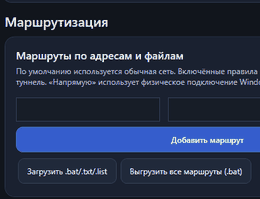

<div align="center">

# WDTTSL / VPNSL

### VPN для Android и Windows на базе CSQTT с управляемой маршрутизацией

**Android выбирает приложения. Windows 1.0.1 работает как full-tunnel и позволяет выводить отдельные адреса/сети из VPN.**

[](https://github.com/Nakortanax/WDTTSL/releases/tag/v1.0.1)
[](#android)
[](#архитектура)
[](https://github.com/Nakortanax/WDTTSL/releases)
[](LICENSE)

### [⬇ Скачать VPNSL Windows 1.0.1](https://github.com/Nakortanax/WDTTSL/releases/tag/v1.0.1)

**[Setup.exe](https://github.com/Nakortanax/WDTTSL/releases/download/v1.0.1/VPNSL-1.0.1-Windows-x64-Setup.exe)** · **[Portable ZIP](https://github.com/Nakortanax/WDTTSL/releases/download/v1.0.1/VPNSL-1.0.1-Windows-x64.zip)**

</div>

> [!IMPORTANT]
> WDTTSL — форк и развитие проекта **[amurcanov/csqtt](https://github.com/amurcanov/csqtt)**. Оригинальный VPN-протокол, Android-клиент и Rust-ядро происходят из upstream-проекта. Windows-адаптация, Wintun-интеграция, интерфейс и дополнительная логика маршрутизации развиваются в этом репозитории. Проект распространяется по **PolyForm Noncommercial License 1.0.0**.

---

## Что такое WDTTSL

WDTTSL объединяет Android-клиент, Windows-клиент и Linux-сервер VPNSL/CSQTT в одном проекте. Клиенты используют одну Rust-транспортную основу, но политика трафика адаптирована под платформу.

### Windows 1.0.1: VPN по умолчанию

После подключения Windows-клиента **весь IPv4-трафик по умолчанию направляется через VPNSL**. Это особенно полезно в сетях, где прямой доступ разрешён только к ограниченному набору сайтов: достаточно, чтобы служебный транспорт VPNSL смог установить соединение, после чего обычный интернет идёт через туннель.

Вкладка **«Маршруты»** при этом не исчезает — она становится инструментом корректировки full-tunnel:

- **Напрямую** — исключить IP/CIDR из VPN и отправить через физическое подключение Windows;
- **Через VPNSL** — явно закрепить выбранный адрес или сеть за туннелем;
- импорт `.bat`, `.txt`, `.list`;
- пакетное применение сотен маршрутов;
- изменение профилей без полного перезапуска VPN;
- генерация IPv4-профиля по имени сайта;
- экспорт текущего набора маршрутов в BAT.

Сам Peer VPNSL и обнаруженные TURN-транспортные адреса автоматически получают прямые `/32` маршруты через физический шлюз, чтобы full-tunnel не отправил внешний транспорт клиента обратно внутрь собственного туннеля.

> [!NOTE]
> Full-tunnel в Windows 1.0.1 относится к **IPv4**. IPv6 в текущей реализации не объявляется как туннелируемый.

---

## Что выделяет WDTTSL

| Возможность | Android | Windows |
|---|:---:|:---:|
| Rust-клиент CSQTT / VPNSL | ✅ | ✅ |
| Выбор установленных приложений | ✅ | — |
| «Только выбранные» / «исключить выбранные» приложения | ✅ | — |
| Full-tunnel IPv4 по умолчанию | — | ✅ |
| Исключения IPv4/CIDR **«Напрямую»** | — | ✅ |
| Явные правила **«Через VPNSL»** | — | ✅ |
| Импорт `.bat`, `.txt`, `.list` | — | ✅ |
| Генератор маршрутов по доменному имени | — | ✅ |
| Пакетное применение больших списков | — | ✅ |
| Нативный Wintun-интерфейс | — | ✅ |
| Установка Linux-сервера по SSH из GUI | — | ✅ |
| Серверные бинарники `amd64`, `arm64`, `armv7` | ✅ | ✅ |
| Тёмный интерфейс | ✅ | ✅ |

> **Ключевое сочетание этого форка:** Android-маршрутизация по приложениям + Windows full-tunnel с CIDR-исключениями + управление Linux-сервером, при общей Rust-транспортной основе.

---

## Интерфейс Windows

<div align="center">
  
  &nbsp;
  
</div>

<p align="center"><i>Тёмный интерфейс Windows-клиента: маршруты и параметры подключения.</i></p>

Windows-клиент использует WPF, Wintun и self-contained .NET 8. Светлые системные элементы ComboBox заменены собственным тёмным шаблоном, поэтому поля и выпадающие списки соответствуют общей теме интерфейса.

### Как работает full-tunnel

Вместо удаления системного default route клиент устанавливает два более специфичных маршрута:

```text
0.0.0.0/1     → VPNSL / Wintun
128.0.0.0/1   → VPNSL / Wintun
```

Обычный `0.0.0.0/0` Windows остаётся на месте. Благодаря этому более специфичное правило `/24` или `/32` с направлением **«Напрямую»** естественно получает приоритет и может использовать физический шлюз.

Это позволяет одновременно иметь:

```text
Обычный интернет ───────────────→ VPNSL → Internet
                                      ▲
                                      │ по умолчанию

Исключения «Напрямую» ─────────→ физический шлюз
Peer / TURN транспорта ─────────→ физический шлюз
```

---

<a id="android"></a>
## Android

Android-клиент основан на оригинальном CSQTT и Android `VPNService`.

### Маршрутизация по приложениям

Android-клиент поддерживает два сценария:

1. направлять в VPN только выбранные приложения;
2. исключать выбранные приложения из VPN.

Это полезно для приложений, которые используют большое количество неизвестных заранее IP/CDN: вместо поддержки списка адресов выбирается само приложение.

Дополнительно доступны Quick Settings Tile, виджет, Android TV-интерфейс и платформенные сетевые политики.

<div align="center">
  
</div>

---

## Архитектура

```text
┌─────────────────────────┐             ┌────────────────────────────┐
│ Android                 │             │ Windows                    │
│ VPNService              │             │ WPF + Wintun               │
│ выбор приложений        │             │ full-tunnel + CIDR rules   │
└────────────┬────────────┘             └─────────────┬──────────────┘
             │                                        │
             └──────────────┬─────────────────────────┘
                            ▼
                   ┌────────────────┐
                   │ Rust client    │
                   │ CSQTT / VPNSL  │
                   └───────┬────────┘
                           │ TURN / RTP transport
                           ▼
                   ┌────────────────┐
                   │ Linux server   │
                   │ Rust           │
                   └───────┬────────┘
                           ▼
                        Internet
```

---

## Быстрый старт — Windows 1.0.1

1. Скачайте **[Setup.exe](https://github.com/Nakortanax/WDTTSL/releases/download/v1.0.1/VPNSL-1.0.1-Windows-x64-Setup.exe)** или **[Portable ZIP](https://github.com/Nakortanax/WDTTSL/releases/download/v1.0.1/VPNSL-1.0.1-Windows-x64.zip)**.
2. Portable распакуйте полностью и запускайте `VPNSL.Windows.exe`.
3. Подтвердите UAC — права администратора нужны для Wintun и таблицы маршрутизации.
4. Во вкладке **«Туннель»** укажите Peer, пароль и параметры подключения.
5. Нажмите **«Подключить»** — после поднятия Wintun весь IPv4-трафик будет направлен через VPNSL.
6. Если какой-либо адрес или сеть должны работать без VPN, добавьте их во вкладке **«Маршруты»** с направлением **«Напрямую»**.

### Контрольные суммы Windows 1.0.1

```text
VPNSL-1.0.1-Windows-x64-Setup.exe
fa5f84588c009d521cdb1d211f1c8050fb28c967f2b0094d5dd491443cde2b3f

VPNSL-1.0.1-Windows-x64.zip
ee9de4f62071c78177a85390a05b762f5828ebc793833b32201bef3757a91782
```

---

## Практические сценарии

### Сеть с белыми списками

Если напрямую доступны только отдельные сервисы, VPNSL сначала устанавливает служебное соединение, после чего основной IPv4-трафик Windows уходит через туннель. Больше не нужно вручную добавлять каждый новый сайт в список маршрутов.

### Сервис должен работать без VPN

Добавьте IP/CIDR сервиса в профиль **«Напрямую»**. Более специфичный маршрут будет использовать физический шлюз, а остальной интернет останется внутри full-tunnel.

### Большой список исключений

Импортируйте `.bat`, `.txt` или `.list`, предварительно выбрав **«Напрямую»**. Клиент применяет список пакетно.

### Приложение Android использует неизвестные адреса

Выберите само приложение в Android-клиенте — заранее собирать полный список его серверов не требуется.

### Новый VPS

Во вкладке **«Установка»** Windows-клиента можно подключиться по SSH и развернуть серверный бинарник для `amd64`, `arm64` или `armv7`.

---

## Ограничения

- Windows-релиз предназначен для **Windows 10/11 x64**.
- Full-tunnel и правила маршрутизации Windows в текущей реализации работают с **IPv4**.
- Выбор приложений реализован на Android и намеренно отсутствует в Windows-клиенте.
- Для Wintun и изменения маршрутов нужны права администратора.
- IP-адреса сайтов/CDN могут меняться, поэтому созданные по домену профили иногда требуется обновлять.
- Проект не является коммерческим VPN-сервисом: сервер пользователь разворачивает самостоятельно.

---

## Репозиторий

```text
app/             Android-клиент
rust-client/     Rust-клиент VPN
rust-server/     Linux-сервер
windows-client/  Windows WPF-клиент
docs/            изображения и документация
```

Windows-сборки проходят WPF/XAML startup smoke-test, собираются self-contained и публикуются в **[Releases](https://github.com/Nakortanax/WDTTSL/releases)**.

---

## Происхождение и авторы

WDTTSL основан на **[amurcanov/csqtt](https://github.com/amurcanov/csqtt)**.

- **Original CSQTT / protocol / Android / Rust core:** [amurcanov](https://github.com/amurcanov)
- **WDTTSL fork / Windows adaptation / Windows UI:** Sazhaev-IA / [Nakortanax](https://github.com/Nakortanax)

Если вам нужен оригинальный CSQTT без изменений этого форка, используйте upstream-репозиторий.

---

<div align="center">

### VPNSL — весь Windows-трафик через VPN, когда он нужен. Исключения — под вашим контролем.

**[Releases](https://github.com/Nakortanax/WDTTSL/releases)** · **[Windows v1.0.1](https://github.com/Nakortanax/WDTTSL/releases/tag/v1.0.1)** · **[Upstream CSQTT](https://github.com/amurcanov/csqtt)**

</div>
